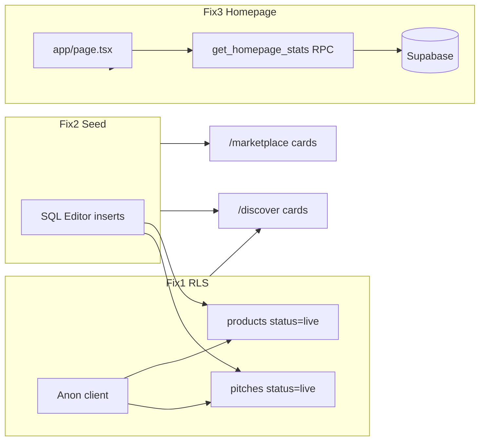

# Ventex fixes: RLS, seed, stats, links, verify

## Current state (from codebase)


| Area                   | Finding                                                                                                                                                                                                                                                 |
| ---------------------- | ------------------------------------------------------------------------------------------------------------------------------------------------------------------------------------------------------------------------------------------------------- |
| RLS                    | Equivalent policies already exist in `[supabase/rls-policies.sql](supabase/rls-policies.sql)`: `"Allow public select on live pitches"` / `"Allow public select on live products"` with `status = 'live'`.                                               |
| Seed                   | User-provided `INSERT` columns **do not match** `[supabase/schema.sql](supabase/schema.sql)`. `ON CONFLICT DO NOTHING` will not dedupe without a unique key on title/name.                                                                              |
| Homepage               | Hardcoded stats in hero (lines 44–50) and Section 3 (lines 95–115) in `[app/page.tsx](app/page.tsx)`. No founding-member banner yet.                                                                                                                    |
| Dead links             | **6** `href="#"` instances, all in `[app/page.tsx](app/page.tsx)` (lines 199, 204, 209, 222, 229, 236).                                                                                                                                                 |
| Routes                 | `/resources/government-schemes` and `/news` **do not exist** under `app/`.                                                                                                                                                                              |
| Discover / marketplace | Already query `.eq('status', 'live')` — `[app/discover/page.tsx](app/discover/page.tsx)`, `[app/marketplace/page.tsx](app/marketplace/page.tsx)`. Empty UI = no rows or RLS blocking reads.                                                             |
| Investor count         | `users` RLS only allows `authenticated` users to read **their own row** (`[supabase/rls-policies.sql](supabase/rls-policies.sql)` lines 18–23). Anon `supabase` client on the homepage **cannot** `COUNT(*)` investors without an additional mechanism. |





---

## FIX 1: Supabase RLS (SQL Editor — manual)

**Action:** Run in Supabase SQL Editor (Dashboard → SQL).

```sql
CREATE POLICY IF NOT EXISTS "Public read live pitches" ON pitches FOR SELECT USING (status='live');
CREATE POLICY IF NOT EXISTS "Public read live products" ON products FOR SELECT USING (status='live');
```

**Notes:**

- Safe to run even if `[supabase/rls-policies.sql](supabase/rls-policies.sql)` was applied earlier — permissive policies are OR’d; duplicate rules do not break reads.
- Requires Postgres 15+ (`IF NOT EXISTS` on policies). Supabase projects use PG 15+.
- If either statement errors on syntax, fall back to the repo pattern: `DROP POLICY IF EXISTS ...` then `CREATE POLICY` (as in `[supabase/store-and-promo-fixes.sql](supabase/store-and-promo-fixes.sql)`).

**Also add (required for Fix 3 investor count):** a `SECURITY DEFINER` RPC so the anon homepage can read aggregates without exposing `users` rows:

```sql
CREATE OR REPLACE FUNCTION public.get_homepage_stats()
RETURNS TABLE(live_pitches bigint, investors bigint)
LANGUAGE sql
SECURITY DEFINER
SET search_path = public
AS $$
  SELECT
    (SELECT COUNT(*)::bigint FROM public.pitches WHERE status = 'live'),
    (SELECT COUNT(*)::bigint FROM public.users WHERE role = 'investor');
$$;

GRANT EXECUTE ON FUNCTION public.get_homepage_stats() TO anon, authenticated;
```

Add this to a new repo file `[supabase/homepage-stats-rpc.sql](supabase/homepage-stats-rpc.sql)` so it is versioned and re-runnable.

---

## FIX 2: Seed data (SQL Editor — schema-correct)

**Do not run the user INSERT verbatim** — it references non-existent columns (`stage`, `state`, `seeking_amount`, `equity_offered`, `valuation`, `founder_name`, `title` on products, `seller_name`).

**Use conditional inserts** (only when table has no live rows), aligned with `[supabase/schema.sql](supabase/schema.sql)` and discover/marketplace field usage:

```sql
-- Pitches (if no live pitches)
INSERT INTO public.pitches (
  title, tagline, industry, company_stage, country, city,
  status, amount_seeking, equity_pct, is_raising, ai_summary
)
SELECT
  'VentexDemo',
  'India startup platform',
  'SaaS',
  'Seed',
  'India',
  'Kerala',
  'live',
  5000000,
  10,
  true,
  'Demo pitch for Ventex early access.'
WHERE NOT EXISTS (SELECT 1 FROM public.pitches WHERE status = 'live' LIMIT 1);

-- Products (if fewer than 2 live products)
INSERT INTO public.products (name, description, price, category, status, type)
SELECT * FROM (VALUES
  ('Pitch Deck Template', 'Investor-ready 12-slide template', 999, 'Templates', 'live', 'fixed_price'),
  ('SaaS Financial Model', 'Excel + Google Sheets model', 1499, 'Templates', 'live', 'fixed_price')
) AS v(name, description, price, category, status, type)
WHERE (SELECT COUNT(*) FROM public.products WHERE status = 'live') < 2;
```

**Alternative:** Run existing `[supabase/test-data.sql](supabase/test-data.sql)` (3 live pitches) plus `[scripts/insert-test-products.js](scripts/insert-test-products.js)` with service role (6 products) if you prefer repo scripts over new SQL.

Add corrected SQL as `[supabase/seed-ventex-demo.sql](supabase/seed-ventex-demo.sql)`.

---

## FIX 3: Homepage stats (`[app/page.tsx](app/page.tsx)`)

**Fetch counts** at top of `Home()` (server component):

```ts
const { data: statsRows } = await supabase.rpc('get_homepage_stats');
const livePitches = Number(statsRows?.[0]?.live_pitches ?? 0);
const investors = Number(statsRows?.[0]?.investors ?? 0);
const showFoundingBanner = livePitches < 10 || investors < 10;
```

(Default threshold: **either** count < 10 triggers banner; easy to tighten to “both” if you prefer.)

**Hero subline (lines 44–50):** Replace static copy with live values when `!showFoundingBanner`:

- `{livePitches} Startups` (no fake `500+` unless you want a `+` only when ≥ 500)
- `{investors} Investors`
- Third metric: derive “raised” from live pitches, e.g. `SUM(amount_seeking)` for `is_raising = true` via a second RPC field or extra column in `get_homepage_stats` — format with existing `formatCurrency()` (same pattern as pitch cards). If you want to match the user’s two queries only, show startups + investors in hero and drop or simplify the third metric when counts are small.

**Section 3 stats bar (lines 95–115):**

- If `showFoundingBanner`: replace the 4-column grid with a single centered banner:
  - `🚀 Early Access — Be a Founding Member · Limited spots`
  - Optional: link to `/signup`
- Else: replace the four hardcoded cells with **real** numbers:
  - Startups Listed → `livePitches`
  - Active Investors → `investors`
  - Industries → `COUNT(DISTINCT industry)` from live pitches (add to RPC) or hide fourth column if not specified
  - in Deals → optional `SUM(amount_seeking)` from live raising pitches (add to RPC) instead of static `₹10Cr+`

**No new UI component file required** — keep inline in `page.tsx` to minimize scope.

---

## FIX 4: Dead links (`[app/page.tsx](app/page.tsx)`)


| Line          | Change                                                                                                                               |
| ------------- | ------------------------------------------------------------------------------------------------------------------------------------ |
| 199, 204, 209 | `href="#"` → `href="/resources/government-schemes"` on all three “Learn more →” links                                                |
| 222, 229, 236 | Remove `<Link href="#">` wrappers; keep “Read →” as plain `<span>` (per “remove the link” — avoids 404 since `/news` does not exist) |


**New route (prevents 404 on Learn more):** `[app/resources/government-schemes/page.tsx](app/resources/government-schemes/page.tsx)` — minimal page: title, short intro, list the three schemes already on the homepage. Reuse `Layout` via existing app layout.

**Verification:** `rg 'href="#"'` across repo → expect **0** matches (terms page uses `href={\`#${id}}` — not in scope).

---

## FIX 5: Verify + discover screenshot

**Local checks (after SQL + code deploy):**

1. `npm run dev` (or existing dev command from `package.json`)
2. `/discover` — ≥ 1 pitch card (title e.g. VentexDemo or test-data names)
3. `/marketplace` — ≥ 2 product cards
4. `/` — Section 3 shows real counts **or** founding-member banner; hero reflects same data policy
5. `rg 'href="#"'` → zero

**Screenshot:** Capture `/discover` with pitch cards visible (browser devtools or OS screenshot). The implementing agent cannot attach an image in plan mode; during execution, open `http://localhost:3000/discover` after seeding and save/share the screenshot.

**If discover/marketplace still empty after seed:**

- Confirm RLS policies applied (Fix 1)
- In SQL Editor: `SELECT COUNT(*) FROM pitches WHERE status='live';` and same for products
- Check browser network tab for Supabase errors on discover fetch

---

## File change summary


| File                                                                                     | Action                                 |
| ---------------------------------------------------------------------------------------- | -------------------------------------- |
| `[supabase/homepage-stats-rpc.sql](supabase/homepage-stats-rpc.sql)`                     | **New** — RPC + grants                 |
| `[supabase/seed-ventex-demo.sql](supabase/seed-ventex-demo.sql)`                         | **New** — corrected conditional seed   |
| `[app/page.tsx](app/page.tsx)`                                                           | Stats RPC, founding banner, link fixes |
| `[app/resources/government-schemes/page.tsx](app/resources/government-schemes/page.tsx)` | **New** — target for Learn more links  |


**No changes required** to discover/marketplace query logic if RLS + seed succeed.

---

## Risk / dependency checklist

- `.env.local` must have `NEXT_PUBLIC_SUPABASE_URL` and `NEXT_PUBLIC_SUPABASE_ANON_KEY` for homepage RPC and pages.
- Fix 3 **depends** on Fix 1 RPC (investor count); pitch count works with existing public pitch policy alone.
- User-provided seed SQL must be **adapted** before running (documented above).
- Screenshot is a **manual / browser** step at the end of implementation.

